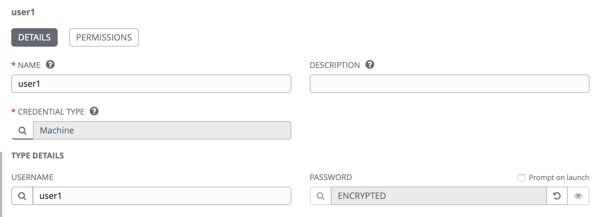

# CEM / Ansible Tower Integration worked example

[Ansible Tower](https://fs20atsrv.169.62.229.236.nip.io/#/home)

credentials `admin / grey-hound-red-cardinal`

Target Machine `ssh -i private_key root@169.62.229.200`

Ansible Users `user1` > `user50` password `alpine-has-acorn-valley`

`user1` > `user50` password `alpine-has-acorn-valley`

[ICP Login](https://icp-console.apps.169.61.23.248.nip.io/oidc/login.jsp)

credentials `admin / grey-hound-red-cardinal`

[Cloud Event Manager](https://icp-console.apps.169.61.23.248.nip.io/cemui/administration)

## Setup and Ansible Project   

## Ansible Tower Configuration - Step by Step

1. Create an Inventory - “Demo Setup” Inventory is already created
2. Create a Host - “169.62.229.200” target host is already created.
3. Create a Credential - “root” credential is already created.
4. Setting up a Project
5. Create a Job Template
6. Trigger the Job

### 1. Setting up a Project

Link Project to Git Repository


Add assets to Git


Change `AnsibleTower/samples/nginx_container.yaml` to parameterise `port` and `container name`.

```
---
- hosts: all
  tasks:
    - name: Run a command to start nginx container
      command: docker run --name={{ nginxname }} -p {{ nginxport }}:80 -d nginx
      become: true

    - name: check {{ nginxname }} container status running on {{ nginxport }}
      command: docker ps -f name={{ nginxname }}
      become: true
      register: finalout
    - debug: var=finalout.stdout_lines

    - debug:
        msg: Access Nginx using http://169.62.229.200:{{ nginxport }}
```

### 2. Create or copy an Ansible Template


Complete details

NAME
PROJECT
PLAYBOOK
CREDENTIALS (prompt at launch check box)


### 3. Trigger the Job from MCM RunBook

MCM - `Monitor Health` > `Incidents` > `Administration` > `RunBooks Configured`


> `Automations`


select `playbook` from Ansible `project`


Get Ansible `user` details


Get user index from web URL

`https://fs20atsrv.169.62.229.236.nip.io/#/credentials/3`

Note that the index for `user01` is `3`

Make sure you add a `PASSWORD` for your user



From CEM `New Automation` you can provide default values or provide at runtime. I will provide a default value for the user but not the `port` or `container name`


save away and see


Select `test` against our new `automation`


See we have one default value but others have to be completed


value have to be valid json

`{ "nginxport" : "11033" , "nginxname" : "ACMEnginx" }`

Complete, apply and then run


Now look at the finished result


Here is our running containers

```
*** System restart required ***
Last login: Tue Jan 21 15:59:20 2020 from 169.62.229.236
root@fs20icamtest:~# docker ps
CONTAINER ID        IMAGE               COMMAND                  CREATED              STATUS              PORTS                   NAMES
2e5a2e47e0b3        nginx               "nginx -g 'daemon of…"   About a minute ago   Up About a minute   0.0.0.0:11033->80/tcp   ACMEnginx
ac0d4851025e        nginx               "nginx -g 'daemon of…"   43 minutes ago       Up 43 minutes       0.0.0.0:11122->80/tcp   user22-nginx
```

All done!
