# CEM / Ansible Tower Integration worked example

[Ansible Tower](https://fs20atsrv.169.62.229.236.nip.io/#/home)

admin / grey-hound-red-cardinal

Target Machine `ssh -i private_key root@169.62.229.200`

Ansible Users `user1` > `user50` password `alpine-has-acorn-valley`

[Cloud Event Manager](https://fs20icamlb.169.61.23.248.nip.io:8443)

admin / grey-hound-red-cardinal

## Setup and Ansible Project   

Link Project to Git Repository

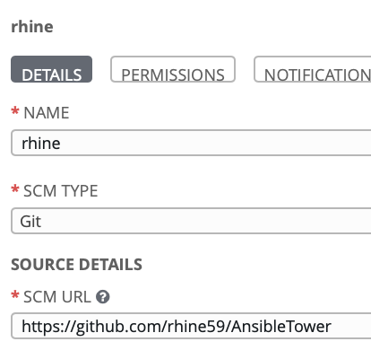

Add assets to Git

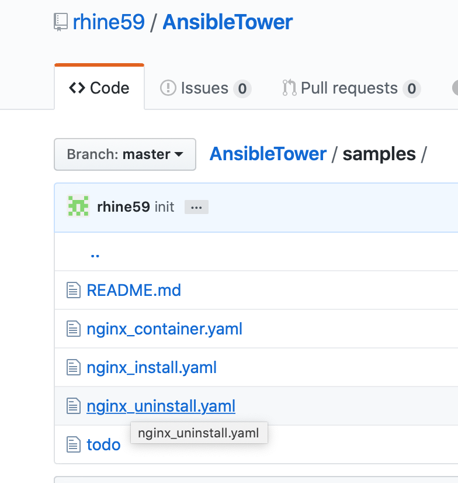

Change `AnsibleTower/samples/nginx_container.yaml` to parameterise `port` and `container name`.

```
---
- hosts: all
  tasks:
    - name: check docker containers running before starting {{ nginxname }} container
      command: docker ps
      become: true
      register: out

    - debug: var=out.stdout_lines

    - name: Run a command to start docker nginx container
      command: docker run --name={{ nginxname }} -p {{ nginxport }}:80 -d nginx
      become: true

    - name: check {{ nginxname }} container status
      command: docker ps -f name={{ nginxname }}
      become: true
      register: finalout
```

Create or copy an Ansible Template

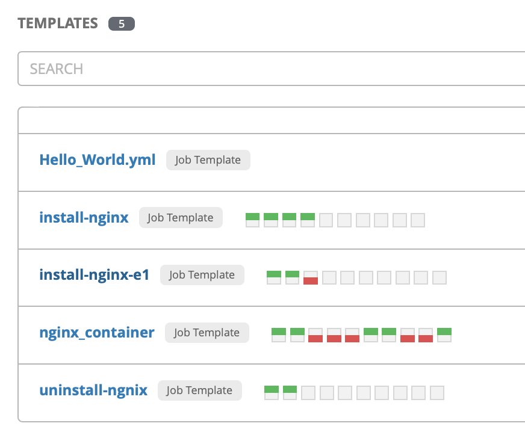

Complete details

NAME
PROJECT
PLAYBOOK
CREDENTIALS (prompt at launch check box)

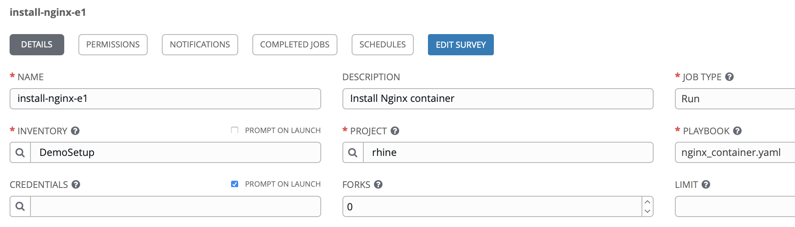

MCM - `Monitor Health` > `Incidents` > `Administration` > `RunBooks Configured`

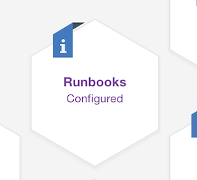

> `Automations`


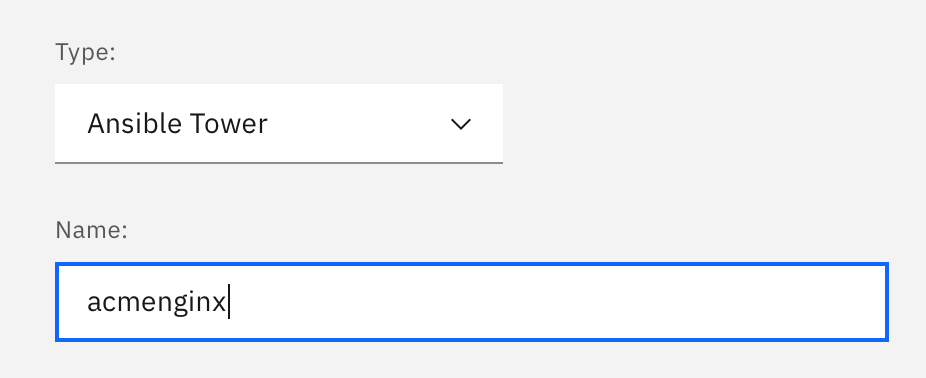

select `playbook` from Ansible `project`

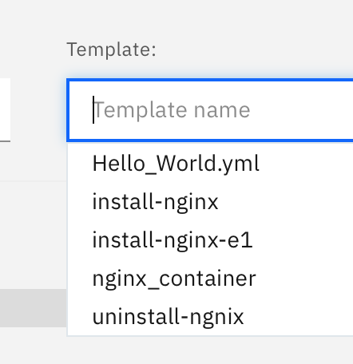

Get Ansible `user` details

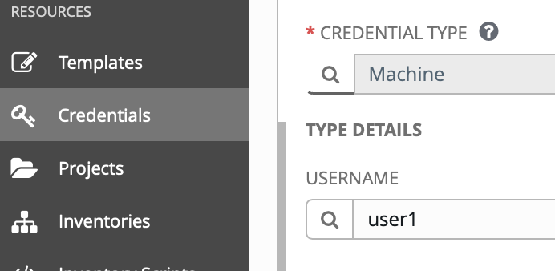

Get user index from web URL

`https://fs20atsrv.169.62.229.236.nip.io/#/credentials/3`

Note that the index for `user01` is `3`

From CEM `New Automation` you can provide default values or provide at runtime. I will provide a default value for the user but not the `port` or `container name`

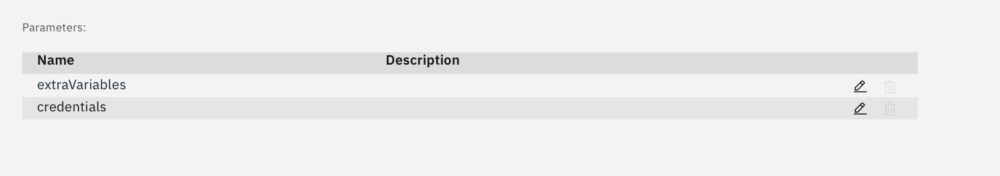

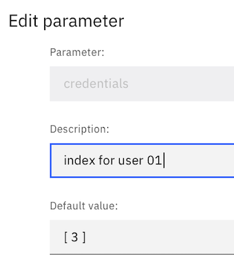

save away and see

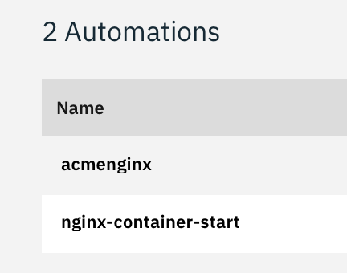

Select `test` against our new `automation`

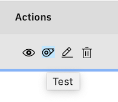

See we have one default value but others have to be completed

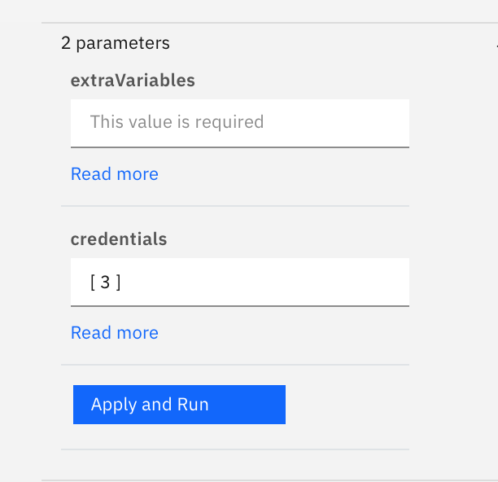

value have to be valid json

`{ "nginxport" : "11033" , "nginxname" : "ACMEnginx" }`

Complete, apply and then run

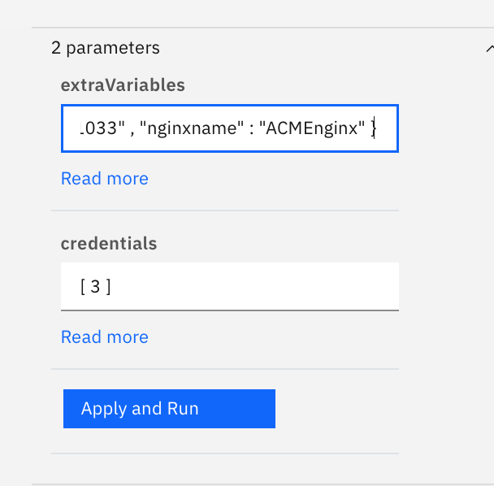

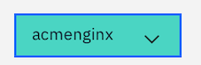

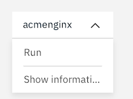

Now look at the finished result

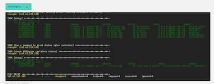

Here is our running containers

```
*** System restart required ***
Last login: Tue Jan 21 15:59:20 2020 from 169.62.229.236
root@fs20icamtest:~# docker ps
CONTAINER ID        IMAGE               COMMAND                  CREATED              STATUS              PORTS                   NAMES
2e5a2e47e0b3        nginx               "nginx -g 'daemon of…"   About a minute ago   Up About a minute   0.0.0.0:11033->80/tcp   ACMEnginx
ac0d4851025e        nginx               "nginx -g 'daemon of…"   43 minutes ago       Up 43 minutes       0.0.0.0:11122->80/tcp   user22-nginx
```

All done!
