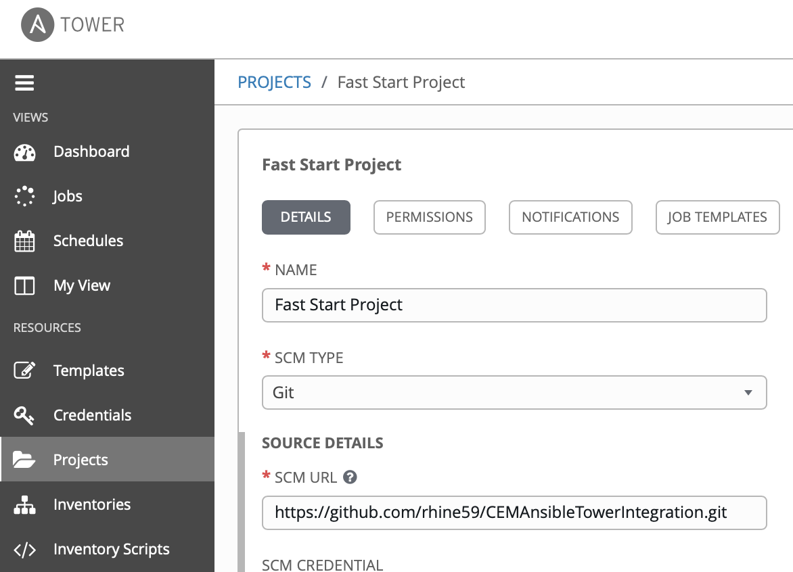
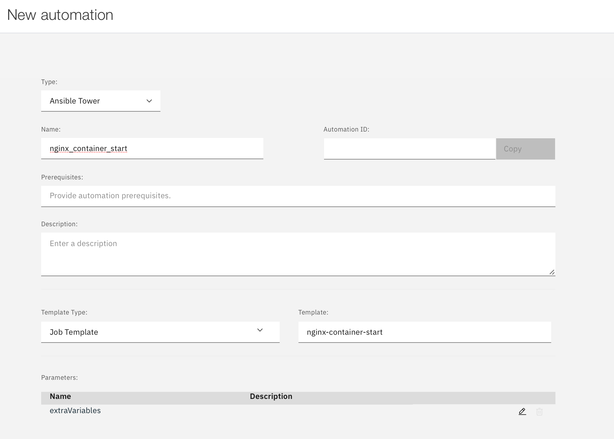
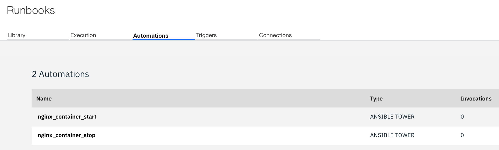
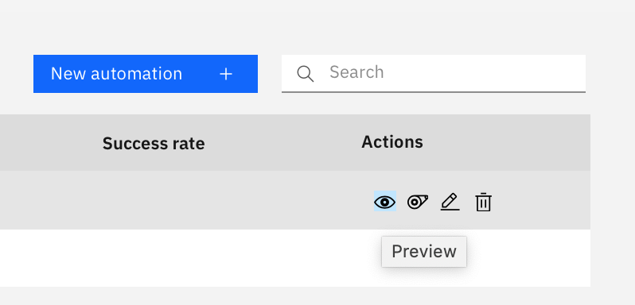
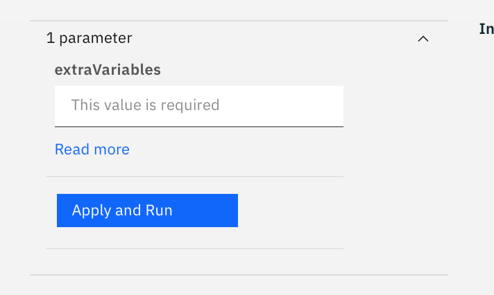
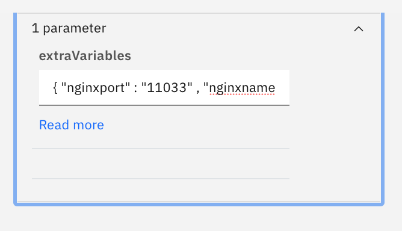
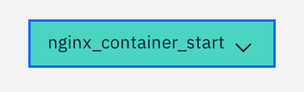
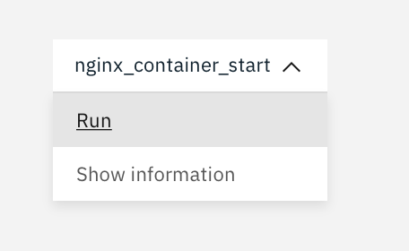
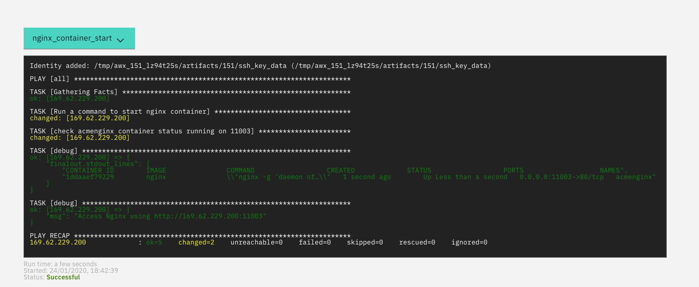
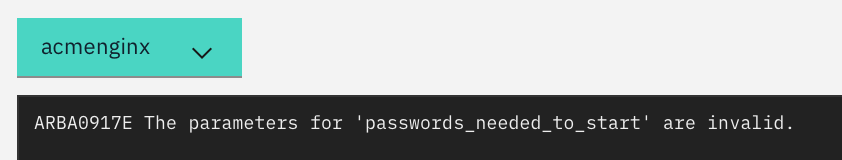

# CEM / Ansible Tower Integration worked example

[GitHub Page](https://rhine59.github.io/CEMAnsibleTowerIntegration/)

<!-- TOC -->

- [CEM / Ansible Tower Integration worked example](#cem--ansible-tower-integration-worked-example)
  - [Access details](#access-details)
  - [Ansible Tower Configuration - Walkthru Step by Step](#ansible-tower-configuration---walkthru-step-by-step)
    - [1. View Project](#view-project)
    - [2. View Ansible Templates](#view-ansible-templates)
  - [CEM Configuration - Step by Step Guide](#ansible-tower-configuration---step-by-step)

<!-- /TOC -->

## Access details

[ICP Login](https://icp-console.apps.169.61.23.248.nip.io/oidc/login.jsp)

[Cloud Event Manager](https://icp-console.apps.169.61.23.248.nip.io/cemui/administration)

[Ansible Tower View Access] (https://fs20atsrv.169.62.229.236.nip.io/)
`user1` > `user50` password `alpine-has-acorn-valley`

## Ansible Tower Configuration - Walkthru Step by Step

We will not provide edit access to Ansible Tower here, but rather show you what we have set up to use from CEM.

1. View Inventory - “Demo Setup” Inventory is already created
2. View Host - “169.62.229.200” target host is already added in Inventory.
3. View Credential - “root” credential is already created for hosts.
4. View Project - "FastStartLabs2020" is already created
5. View Ansible Templates - "nginx-container-start" and "nginx-container-stop" are already created.

### View Project

We have a `project` that is linked to a Git Repository



Create a new project


The `https://github.com/rhine59/CEMAnsibleTowerIntegration.git` Git Repo contains Ansible `playbooks` in the `samples` directory.

```
.
├── README.md
├── nginx_container_start.yaml
├── nginx_container_stop.yaml
├── nginx_install.yaml
└── nginx_uninstall.yaml
```

### View Ansible Templates
Click `Templates` in Ansible menu


View the details


So we now have two job `templates` in Ansible Tower that we can run under `root`. They each execute a `playbook`


If you look at the playbooks, you will see that they are parameterised with values expected for `nginxname` and `nginxport`.

```
nginx_container_start.yaml

---
- hosts: all
  tasks:
    - name: Run a command to start nginx container
      command: docker run --name={{ nginxname }} -p {{ nginxport }}:80 -d nginx
      become: true

    - name: check {{ nginxname }} container status running on {{ nginxport }}
      command: docker ps -f name={{ nginxname }}
      become: true
      register: finalout
    - debug: var=finalout.stdout_lines

    - debug:
        msg: Access Nginx using http://169.62.229.200:{{ nginxport }}
```

If you look again at the Ansible `template` you see that we have default values for these `playbook` variables at the end of the definition.


Also the right of the template definition we ask to prompt for these values.


So we are going run these templates.


To the right of the `template`, select the rocket.


We are prompted to override the variable values.


next ...


STDOUT from the running of the job shows success (EXTRACT)

```

PLAY [all] *********************************************************************
TASK [Run a command to start nginx container] **********************************
TASK [check acmenginx container status running on 11013] ***********************
TASK [debug] *******************************************************************
ok: [169.62.229.200] => {
    "finalout.stdout_lines": [
        "CONTAINER ID        IMAGE               COMMAND                  CREATED             STATUS                  PORTS                   NAMES",
        "1cd2eab239db        nginx               \"nginx -g 'daemon of…\"   1 second ago        Up Less than a second   0.0.0.0:11013->80/tcp   acmenginx"
TASK [debug] *******************************************************************
ok: [169.62.229.200] => {
    "msg": "Access Nginx using http://169.62.229.200:11013"
PLAY RECAP *********************************************************************
169.62.229.200             : ok=5    changed=2    unreachable=0    failed=0    skipped=0    rescued=0    ignored=0   
```

a quick look at the target machines shows the running container.

```
root@fs20icamtest:~# docker ps
CONTAINER ID        IMAGE               COMMAND                  CREATED             STATUS              PORTS                   NAMES
1cd2eab239db        nginx               "nginx -g 'daemon of…"   2 minutes ago       Up 2 minutes        0.0.0.0:11013->80/tcp   acmenginx
```

So from the CEM console from the ICP console.

`Monitor Health` > `Incidents` > `Administration`


takes you to


The go to `runbooks`

Check out that under `Connections` we have a valid connection to `Ansible Tower`


Go to `Automations` and create a `New Automation`



Note that we coule edit the `extraVariables` to provide some defaults for what comes


Complete the details for both start and stop activities



So let's now execute this `runbook` from CEM.



Select the `test` icon to right of the `nginx_container_start` automation.

This is where we have to provide the variable for this Job



we will provide variable values to this job

```
{ "nginxport" : "11003" , "nginxname" : "acmenginx" }
```



and then finally ...

from the coloured icon



we select `run`



The automation runs to completion OK



```
root@fs20icamtest:~# docker ps
CONTAINER ID        IMAGE               COMMAND                  CREATED             STATUS              PORTS                   NAMES
1ddaaef79229        nginx               "nginx -g 'daemon of…"   2 minutes ago       Up 2 minutes        0.0.0.0:11003->80/tcp   acmenginx
root@fs20icamtest:~#
```


### 3. Trigger the Job from MCM RunBook

MCM - `Monitor Health` > `Incidents` > `Administration` > `RunBooks Configured`


> `Automations`


select `playbook` from Ansible `project`


Get Ansible `user` details


Get user index from web URL

`https://fs20atsrv.169.62.229.236.nip.io/#/credentials/3`

Note that the index for `user01` is `3`

Make sure you add a `PASSWORD` for your user


If you do NOT do this, then you will get ...



`passwords_needed_to_start` errors!

From CEM `New Automation` you can provide default values or provide at runtime. I will provide a default value for the user but not the `port` or `container name`


save away and see


Select `test` against our new `automation`


See we have one default value but others have to be completed


value have to be valid json

`{ "nginxport" : "11033" , "nginxname" : "ACMEnginx" }`

Complete, apply and then run


Now look at the finished result


Here is our running containers

```
*** System restart required ***
Last login: Tue Jan 21 15:59:20 2020 from 169.62.229.236
root@fs20icamtest:~# docker ps
CONTAINER ID        IMAGE               COMMAND                  CREATED              STATUS              PORTS                   NAMES
2e5a2e47e0b3        nginx               "nginx -g 'daemon of…"   About a minute ago   Up About a minute   0.0.0.0:11033->80/tcp   ACMEnginx
ac0d4851025e        nginx               "nginx -g 'daemon of…"   43 minutes ago       Up 43 minutes       0.0.0.0:11122->80/tcp   user22-nginx
```

All done!
