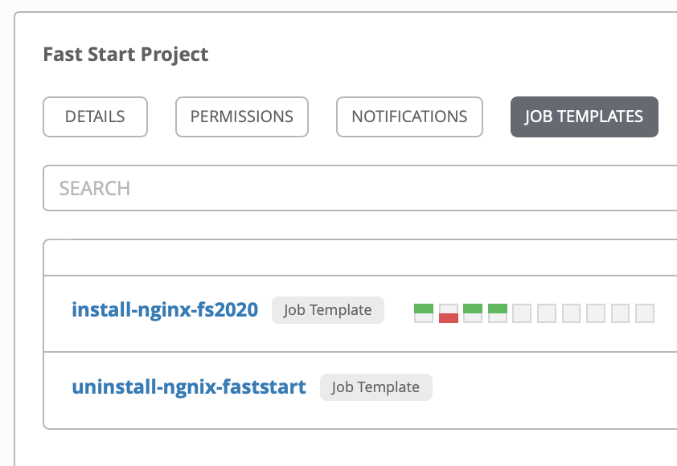

# Walkthrough of Ansible Tower.

We will not provide direct access to Ansible Tower here, but rtaher, we will show you what we have set up to use from CEM

We have a `project` that is linked to a Git Repository

The `https://github.com/rhine59/CEMAnsibleTowerIntegration.git` Git Repo contains Ansible `playbooks`

